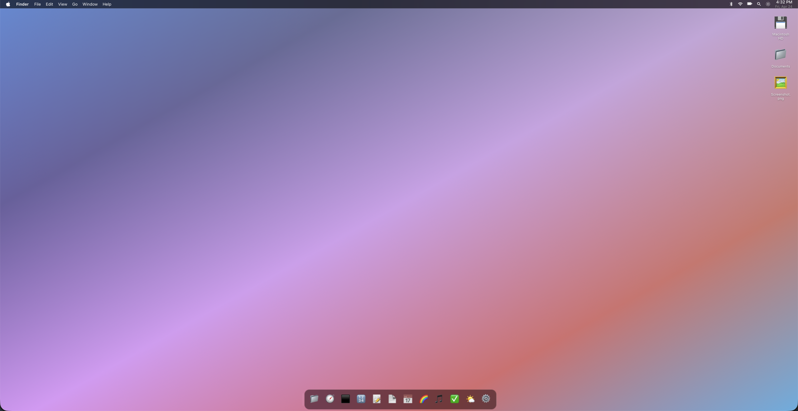

# macOS Web

A fully functional browser-based macOS clone with window management, dock, spotlight, and 12 working apps — zero dependencies, pure HTML/CSS/JS.



> **"Create a browserbased os that mimics macos - add a lot of features and make it perfect + add functional apps"**
> — The original prompt that generated this entire project.

## Demo

👉 **Try it live:** [joonanykanen.github.io/macos-web](https://joonanykanen.github.io/macos-web)

## Features

### Desktop Environment
- **Boot sequence** with animated Apple logo and progress bar
- **Login screen** with blurred wallpaper, live clock, and password field
- **Menu bar** with Apple menu, dynamic app menus, system icons, and live clock
- **Window manager** supporting drag, resize (8 handles), minimize, maximize, close, z-index stacking, and double-click titlebar to fullscreen
- **Dock** with 12 apps, hover magnification, bounce animation, active app dots, and tooltips
- **Spotlight** (`Cmd/Ctrl+Space`) with app search and web search integration
- **Control Center** with Wi-Fi, Bluetooth, AirDrop toggles, sound/display sliders, Focus modes, Lock screen, and Screenshot
- **Notification Center** with toast notifications and auto-dismiss
- **Right-click context menu** on desktop
- **Keyboard shortcuts**: `Cmd+W` (close), `Cmd+M` (minimize), `Cmd+,` (prefs), `Escape` (dismiss)

### 12 Functional Apps

| App | Description |
|-----|-------------|
| **Finder** | Virtual filesystem with sidebar navigation, grid/list views, path bar, back/forward, double-click folders |
| **Terminal** | 50+ commands including `ls`, `cd`, `cat`, `mkdir`, `rm`, `cp`, `mv`, `find`, `tree`, `neofetch`, `cowsay`, `fortune`, `matrix`, `ping`, `grep`, `sort`, `wc`, Tab autocomplete, arrow history, Ctrl+C |
| **Calculator** | Full arithmetic, keyboard support, chaining operations, percentage, negate |
| **Notes** | Multiple notes, auto-save, word/line count, create new notes |
| **TextEdit** | Rich text editor with bold, italic, underline, strikethrough, alignment, lists, undo/redo |
| **Safari** | URL bar, back/forward/reload, favorites grid, iframe browsing, Google search |
| **Calendar** | Monthly view, navigation, today button, event indicators, click dates |
| **System Preferences** | 14 panels: General, About, Wallpapers (live change!), Appearance (accent colors), Dock size, Display brightness, Sound, Wi-Fi, Bluetooth, Keyboard, Trackpad, Notifications, Privacy |
| **Photos** | 16 gradient photos, sidebar albums, grid view |
| **Music** | 10-track album, play/pause, prev/next, progress bar, volume, track selection |
| **Reminders** | 4 lists (All/Personal/Work/Shopping), add/complete/delete, counters |
| **Weather** | 4 cities, 7-day forecast, gradient backgrounds, humidity/wind/UV |

## Technical Details

- **~7,000 lines** of code across 16 files
- **Zero dependencies** — pure vanilla HTML, CSS, and JavaScript
- **Class-based architecture** with separate modules per app
- **Custom window manager** with drag, resize, minimize, maximize, and z-index management
- **Virtual filesystem** implemented as nested JavaScript objects
- **CSS custom properties** for theming and accent colors
- **Backdrop-filter blur** for macOS-style frosted glass effects
- **CSS animations** for boot sequence, window open/close, dock bounce, and notifications
- **Event delegation** for efficient DOM handling
- **No frameworks or build tools** — runs directly in any modern browser

## Project Structure

```
mac-os/
├── index.html              # Main entry point
├── css/
│   └── style.css           # Complete stylesheet (~46KB)
├── js/
│   ├── app.js              # Main application, desktop init, menus, spotlight
│   ├── window-manager.js   # Window management system
│   └── apps/
│       ├── calculator.js   # Calculator app
│       ├── calendar.js     # Calendar app
│       ├── finder.js       # Finder app with virtual filesystem
│       ├── music.js        # Music player app
│       ├── notes.js        # Notes app
│       ├── photos.js       # Photos app
│       ├── reminders.js    # Reminders app
│       ├── safari.js       # Safari browser app
│       ├── system-prefs.js # System Preferences app
│       ├── terminal.js     # Terminal with 50+ commands
│       ├── textedit.js     # Rich text editor
│       └── weather.js      # Weather app
└── macOS-web-screenshot.png
```

## Local Development

Simply open `index.html` in any modern browser. No server or build step required.

```bash
# Or serve locally:
npx serve .
# or
python3 -m http.server 8000
```

## Disclaimer

> ⚠️ This entire codebase was written by an LLM Agent (**Qwen3.6-27B**). No human wrote any of the code. The project was created through a single conversation where the agent planned, architected, and implemented the full macOS clone from scratch.

## License

MIT